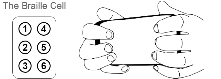
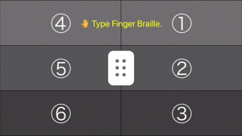
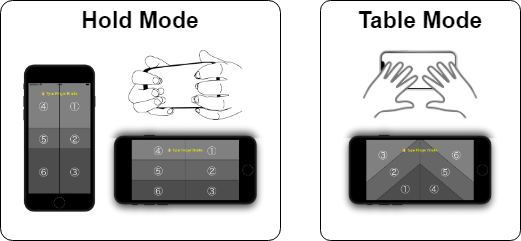
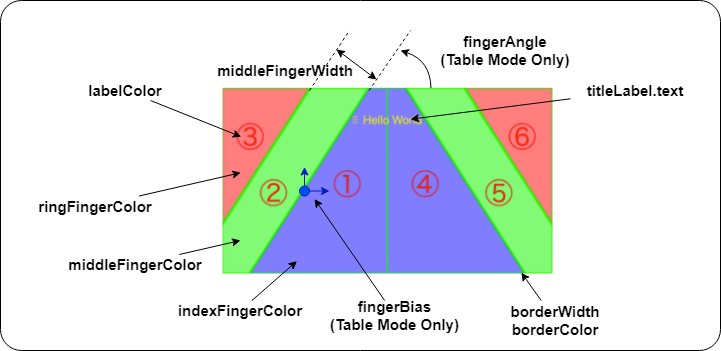

# YubitenReader

Reads Braille input by screen touch for iPhone.





- The position of the dots appears to be reversed in the video above, but appears correct when viewed from the back of the device.
- Example of use : https://github.com/63rabbits/YubitenReaderSample

## Features


- Recognizes Braille and Swipes.

    - Braille
        - Recognized Braille is converted to [Unicode (U+2801~U+283F)](https://en.wikipedia.org/wiki/Braille_Patterns#Block).
        - Annotation
          - The moment even one touched finger is released, the Braille is recognized including the remaining touches.
          - The ⠿ is recognized at the moment of a 6-points touch. (The upper limit for multi-touch on the iphone is 5-points touch. If this is exceeded, an cancel-event will occur. This event is recognized as ⠿.)
          - Failure occurs if there are more than 4 points of touch on one side (left or right) of the input screen.
    
    - Swipe
      - 1 to 5-points touch up, down, left, right swipes, and combinations thereof.
  
- Two input modes are available.
    - **Hold Mode**  
      Hold the iPhone with the screen facing away from you and tap the screen with your finger around it.
    - **Table Mode**  
      Place the iPhone horizontally in front of you.
    
      


- Behavior with Portrait Orientation Lock.
    - OFF
        - When the device is placed vertically, the Hold Mode input screen automatically rotates. 
        - When the device is placed horizontally, the input screen becomes the Table Mode input screen.
    - ON
      - The screen is fixed to Portrait, so only the Hold Mode input screen is displayed. However, a method is provided to specify the orientation of the input screen ( **lockIfOrientation()** ). This method should be called with a specific swipe operation.
- Disable animation to prevent swipes caused by touch during rotation.


## Usage

1. Use the Swift Package Manager to install YubitenReader as a dependency of your project.
2. The application should be coded as follows.
    - AppDelegate.swift  
    Add the following method to let YubitenReader handle screen rotation.

        ```swift
        import UIKit

        @main
        class AppDelegate: UIResponder, UIApplicationDelegate {
            ...

            func application(_ application: UIApplication, supportedInterfaceOrientationsFor window: UIWindow?) -> UIInterfaceOrientationMask {
                return .all
            }
        }
        ```

    - ViewController.swift  
    Add the following method to ensure screen lock.

        ```swift
        import UIKit
        import YubitenReader

        class ViewController: UIViewController {
            ...

            override var supportedInterfaceOrientations: UIInterfaceOrientationMask {
                return yubitenReader?.supportedIfOrientations ?? .all
            }
        }
        ```


3. The recognized Braille is received as follows.

    ```swift
    import UIKit
    import YubitenReader
    
    class ViewController: UIViewController {
    
        var yubitenReader: YubitenReader!
    
        override func viewDidLoad() {
            super.viewDidLoad()
    
            yubitenReader = YubitenReader(frame: self.view.frame, handler: brailleReader)
    
        }
        
        func brailleReader(reco: YubitenReader.Recognition, braille: String, swipes: [YubitenReader.SwipeType]) {
            switch reco {
                case .braille:
                    print(braille)
    
                case .swipe:
                    if swipes.contains(.swipeDown1) {
                        print("Swipe Down with 1 finger")
                    }
    
                case .failure:
                    print("?")
            }
        }

	...
    
    }
    ```
    ```swift
    public enum Recognition {
        case braille
        case swipe
        case failure
    }

    public enum SwipeType: String {
        case swipeUp1       = "swipe U1"    // swipe Up with 1 finger
        case swipeUp2       = "swipe U2"    // swipe Up with 2 fingers
        case swipeUp3       = "swipe U3"    // swipe Up with 3 fingers
        case swipeUp4       = "swipe U4"    // swipe Up with 4 fingers
        case swipeUp5       = "swipe U5"    // swipe Up with 5 fingers

        case swipeDown1     = "swipe D1"    // swipe Down with 1 finger
        case swipeDown2     = "swipe D2"    // swipe Down with 2 fingers
        case swipeDown3     = "swipe D3"    // swipe Down with 3 fingers
        case swipeDown4     = "swipe D4"    // swipe Down with 4 fingers
        case swipeDown5     = "swipe D5"    // swipe Down with 5 fingers

        case swipeLeft1     = "swipe L1"    // swipe Left with 1 finger
        case swipeLeft2     = "swipe L2"    // swipe Left with 2 fingers
        case swipeLeft3     = "swipe L3"    // swipe Left with 3 fingers
        case swipeLeft4     = "swipe L4"    // swipe Left with 4 fingers
        case swipeLeft5     = "swipe L5"    // swipe Left with 5 fingers

        case swipeRight1    = "swipe R1"    // swipe Right with 1 finger
        case swipeRight2    = "swipe R2"    // swipe Right with 2 fingers
        case swipeRight3    = "swipe R3"    // swipe Right with 3 fingers
        case swipeRight4    = "swipe R4"    // swipe Right with 4 fingers
        case swipeRight5    = "swipe R5"    // swipe Right with 5 fingers
    }
    ```

## Additional Functions

- Guide Customization

    | # | properties | description | default |
    | :-: | :--- | :--- | :--- |
    | 1 | titleLabel.text | see figure. | "\u{1F91A} Type Finger Braille." |
    | 2 | backgroundColor | Background color when the guide screen is hidden. | UIColor.black |
    | 3 | showGuide | Show/hide guide screen. | false |
    | 4 | middleFingerWidth | see figure.<br>For zero values, the following calculation results are used.<br>middleFingerWidth = min(width, height) / 3 | 0 |
    | 5 | fingerAngle | see figure. (radian) (Table Mode Only) | 0.698132(=40°) |
    | 6 | fingerBias | see figure. (Table Mode Only) | (x, y) = (0, -20) |
    | 7 | labelColor | see figure. | UIColor.white |
    | 8 | indexFingerColor | see figure. | UIColor(red: 0.5, green: 0.5, blue: 0.5, alpha: 1) |
    | 9 | middleFingerColor | see figure. | UIColor(red: 0.4, green: 0.4, blue: 0.4, alpha: 1) |
    | 10 | ringFingerColor | see figure. | UIColor(red: 0.3, green: 0.3, blue: 0.3, alpha: 1) |
    | 11 | borderWidth | see figure. | 1.0 |
    | 12 | borderColor | see figure. | UIColor.black |
    
    ```swift
    // Example :
    yubitenReader.titleLabel.text = "\u{283f} Hello World"
    yubitenReader.backgroundColor = UIColor(red: 0, green: 0, blue: 1.0, alpha: 0.5)

    yubitenReader.showGuide = true

    yubitenReader.middleFingerWidth = 100
    yubitenReader.fingerAngle = 1.0  // radian
    yubitenReader.fingerBias = CGPoint(x: -50, y: 0)
    yubitenReader.labelColor = UIColor.red
    yubitenReader.indexFingerColor = UIColor.red.withAlphaComponent(0.5)
    yubitenReader.middleFingerColor = UIColor.green.withAlphaComponent(0.5)
    yubitenReader.ringFingerColor = UIColor.blue.withAlphaComponent(0.5)
    yubitenReader.borderWidth = 5
    yubitenReader.borderColor = UIColor.green.withAlphaComponent(0.5)
    ```

	


- Touch Spot

    | # | properties | description | default |
    | :-: | :--- | :--- | :--- |
    | 1 | showTouchSpot | show/hide spot | true |
    | 2 | touchSpotSize | spot diameter | 80 |
    | 3 | touchSpotColor | spot color | UIColor.yellow.withAlphaComponent(0.5) |

	```swift
    // Example :
    yubitenReader.showTouchSpot = true
    yubitenReader.touchSpotSize = 80
    yubitenReader.touchSpotColor = UIColor.blue.withAlphaComponent(0.5)
    ```


- Swipe  

    | # | properties | description | default |
    | :-: | :--- | :--- | :--- |
    | 1 | swipeDistance | Travel distance to be determined as a swipe. | 50 |
    
    ```swift
    // Example :
    yubitenReader.swipeDistance = 50
    ```


- Vibration  
Vibrates when the designated Braille is touched. This function allows the visually impaired to confirm the touch position.

  | # | properties | description | default |
  | :-: | :--- | :--- | :--- |
  | 1 | vibration | vibration on/off | false |
  | 2 | vibrationBraille | braille array | [ ] (empty) |
  | 3 | vibrationInterval | vibration interval | 0.1 (sec) |
  | 4 | vibrationSound | sound on/off | false |
  | 5 | vibrationSoundID | SystemSoundID | 1105 ( = Tock.caf ) |
  
    ```swift
    // Example :
    yubitenReader.vibration = true
    yubitenReader.vibrationBraille = [ "\u{2802}", "\u{2810}" ]     // ②,⑤
    yubitenReader.vibrationInterval = 0.2       // sec
    yubitenReader.vibrationSound = true
    yubitenReader.vibrationSoundID = 1057       // Tink.caf ... see Sound.swift
    ```


- Guide Spot  
Displays a spot at the specified Braille location. This function is designed to help sighted people users learn finger Braille.

  | # | properties | description | default |
  | :-: | :--- | :--- | :--- |
  | 1 | guideSpot | show/hide gude spot | false |
  | 2 | guideSpotBraille | braille | "" |
  | 3 | guideSpotSize | spot diameter | 80 |
  | 4 | guideSpotColor | spot color | UIColor.green.withAlphaComponent(0.5) |
  
    ```swift
    // Example :
    yubitenReader.guideSpot = true
    yubitenReader.guideSpotBraille = "\u{2812}"   // ②,⑤
    yubitenReader.guideSpotSize = 70
    yubitenReader.guideSpotColor = UIColor.black.withAlphaComponent(0.5)
    ```

- Utility Methods

    | # | Methods, Properties | Description |
    | :---: | :--- | :--- |
    | 1 | func lockIfOrientation() | Lock to the specified Interface Orientation.<br>isFlat = false : Hold Mode Guide, = true : Table Mode Guide. |
    | 2 | func unlockIfOrientation() | Unlock Interface Orientation. |
    | 3 | var isLocked | read only : Bool |
    | 4 | var supportedIfOrientations | read only : UIInterfaceOrientationMask |
    | 5 | var devOrientation | read only :  UIDeviceOrientation? |
    | 6 | var ifOrientation | read only : UIDeviceOrientation? |

    ```swift
    public func lockIfOrientation(_ ifOrientation: UIInterfaceOrientation, isFlat: Bool) {}
    public func unlockIfOrientation() {}
    public var isLocked: Bool
    public var supportedIfOrientations: UIInterfaceOrientationMask
    public var devOrientation: UIDeviceOrientation?
    public var ifOrientation: UIInterfaceOrientation?
    ```

## Braille Recognition Details

On one side of the screen, the Braille is recognized as follows. The same method is used on the other side.


- 1-Point Touch  
Recognizes Braille at the touched position as guided.


- 2-Points Touch  
Recognize by vote as shown in the following table.
  
  |  left side  |       #      |       #      |       #      |       #      |       #      |       #      |  right side |
  | :---------: | :----------: | :----------: | :----------: | :----------: | :----------: | :----------: | :---------: |
  |      ①      |       1      |              |       1      |       2      |              |              |      ④      |
  |      ②      |       1      |       1      |              |              |       2      |              |      ⑤      |
  |      ③      |              |       1      |       1      |              |              |       2      |      ⑥      |
  | Recognition | ●<br>●<br>- | -<br>●<br>● | ●<br>-<br>● | ●<br>●<br>- | -<br>●<br>● | -<br>●<br>● | Recognition |


- 3-Points Touch  
Recognize each point as touched.


- 4-Points Touch and more  
Suppose that recognition fails.

---
Origin of the name : finger braille = 指点字 ( yubi tenji ) -> Yubiten

